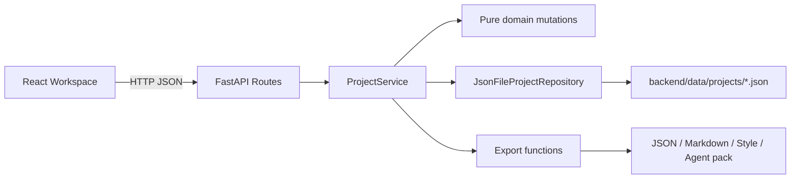

# ShadowSpeakerSDE

<p align="center">
  
</p>

<p align="center"><em>Words and Sounds share a common space</em></p>

**ShadowSpeakerSDE** is a visual **Story Development Environment** for novelists. It is not a generic project board, kanban tool, or document editor with story labels glued on. It is a local-first workspace for designing long-form fiction: chapters, plots and subplots, structured story blocks, continuity notes, and chapter drafts — then exporting that material in formats that humans can read and that agentic writing workflows can consume chapter by chapter without losing narrative consistency.

This repository contains both:

- a **Python / FastAPI** backend that owns the domain model, validation, persistence, and exports
- a **React / TypeScript / Vite** frontend that presents a three-region story workspace (timeline, chapter columns, block bins)

Together they form a coherent vertical slice: create a story project, plan chapters and subplots, place typed blocks, link them across chapters, write or paste chapter drafts and continuity summaries, save and reload from disk, and export story context, writing style, and an **agent writing pack**.

---

## Getting started

Installation and local deploy are driven by **Make**. Tool checks run before install so missing Python/Node/npm/curl (and busy ports) fail early with clear messages instead of halfway through setup.

### One-time install

From the repository root:

```bash
make install
```

This runs `make check-tools`, then creates the backend virtualenv, installs Python packages, and installs frontend npm packages.

To verify the toolchain alone:

```bash
make check-tools
```

### Deploy (run the app)

```bash
make deploy
```

`deploy` runs `install` (including tool checks) and then starts the API and UI. When healthy you get:

- UI: http://127.0.0.1:5173
- API: http://127.0.0.1:8000
- OpenAPI docs: http://127.0.0.1:8000/docs

Useful companions:

```bash
make status   # are API/UI process files alive?
make stop     # stop processes started by deploy/run
make run      # start without reinstalling (after a prior install)
```

If the default ports are taken:

```bash
make deploy API_PORT=8001 WEB_PORT=5174
```

The Makefile exports `VITE_API_PROXY` so the Vite proxy tracks `API_PORT`.

### Prerequisites (checked automatically)

| Tool | Minimum |
|------|---------|
| GNU Make | any recent |
| Python | 3.12+ (`python3` on PATH, with `venv`) |
| Node.js | 20+ |
| npm | bundled with Node |
| curl | used to verify API health on deploy |

### Manual fallback (optional)

If you prefer not to use Make after tools are verified:

```bash
# Backend
cd backend
python3 -m venv .venv
source .venv/bin/activate
pip install -e ".[dev]"
uvicorn shadowspeaker.main:app --reload --port 8000

# Frontend (second terminal)
cd frontend
npm install
npm run dev
```

---

## Table of contents

1. [Getting started](#getting-started)
2. [Why this exists](#why-this-exists)
3. [What you can do today](#what-you-can-do-today)
4. [What is intentionally out of scope](#what-is-intentionally-out-of-scope)
5. [Repository layout](#repository-layout)
6. [Architecture overview](#architecture-overview)
7. [Domain model](#domain-model)
8. [User interface](#user-interface)
9. [Persistence](#persistence)
10. [HTTP API](#http-api)
11. [Exports](#exports)
12. [Agent writing pack (chapter-by-chapter consistency)](#agent-writing-pack-chapter-by-chapter-consistency)
13. [Suggested novelist workflow](#suggested-novelist-workflow)
14. [Suggested agentic writing workflow](#suggested-agentic-writing-workflow)
15. [Configuration notes](#configuration-notes)
16. [Testing, linting, and type checking](#testing-linting-and-type-checking)
17. [Extension points for future agents and retrieval](#extension-points-for-future-agents-and-retrieval)
18. [Tech stack and licenses](#tech-stack-and-licenses)
19. [Known limitations](#known-limitations)
20. [Contributing posture](#contributing-posture)

---

## Why this exists

Long-form fiction fails in boring, expensive ways: characters change eye color between chapters, a subplot vanishes for two hundred pages, a setting detail contradicts earlier prose, or a writing agent invents convenient facts because it only saw the current chapter prompt.

ShadowSpeakerSDE treats the **story plan** as a first-class, inspectable asset:

- **Structured blocks** capture setting, character, dialogue, items, vehicles, and tools as typed fields — not free-form blobs.
- **Plots and subplots** span chapters on a lightweight timeline.
- **Block links** record relationships across chapter boundaries.
- **Continuity summaries** and **draft prose** live on each chapter so later writing passes can honor prior irreversible facts without always re-reading every earlier draft in full.
- **Exports** separate *what happens* (story context) from *how it should sound* (writing style), and additionally provide a merged **agent writing pack** optimized for sequential chapter generation.

The product thesis is simple: **plan locally, validate structurally, export deliberately, write with constraints**.

---

## What you can do today

With the current MVP you can:

1. Create an independent story project with a name and narrative defaults (point of view, writing-style material).
2. Add, edit, delete, and reorder chapters (title, optional subtitle, description, timescale, POV override).
3. Record **continuity summaries** and **draft prose** per chapter.
4. Define plots and subplots and associate them with one or more chapters.
5. Drag block templates (Setting, Character, Dialogue, Special Item, Vehicle, Tool) into chapter workspaces — or use non-drag “Add” / “Move to” controls.
6. Edit structured block fields without mutating the original template.
7. Link blocks across chapters and see those links in the workspace and exports.
8. Move blocks between chapters atomically; reorder blocks within a chapter.
9. Persist the full project as a local JSON file and reload it intact.
10. Export:
    - complete JSON story context
    - readable Markdown story outline
    - writing-style material alone
    - a single **agent writing pack** Markdown file for chapter-chunk novel generation

---

## What is intentionally out of scope

The following are **not** implemented and should not be assumed present:

- user authentication, multi-user collaboration, or cloud sync
- billing or marketplace / remote Block Store APIs
- autonomous novel generation inside the app
- model-provider integrations or embedding pipelines
- production vector databases or semantic search
- full rich-text editing or realtime multiplayer editing
- speculative multi-agent orchestration loops

Narrow protocols exist so those systems can be attached later without rewriting the domain core. The app must remain useful with **no** external model or database configured.

---

## Repository layout

```text
ShadowSpeakerSDE/
├── README.md
├── Makefile                  # install / deploy / test entrypoints
├── scripts/check-tools.sh    # toolchain gate used by make install
├── branding/                 # logo + favicon assets
├── backend/
│   ├── pyproject.toml
│   ├── data/projects/        # Local JSON project files (runtime)
│   ├── src/shadowspeaker/
│   │   ├── domain/           # Pydantic models + pure mutations
│   │   ├── persistence/      # Repository protocol + JSON file store
│   │   ├── export/           # Story / style / agent-pack exporters
│   │   ├── services/         # Application service orchestration
│   │   ├── api/              # FastAPI routes + request schemas
│   │   └── main.py           # ASGI entrypoint
│   └── tests/
└── frontend/
    ├── public/
    │   └── branding/
    ├── src/
    │   ├── api.ts
    │   ├── types.ts
    │   ├── App.tsx
    │   ├── components/       # Timeline, workspace, bins, editor
    │   └── hooks/
    └── vite.config.ts        # Dev proxy to the API (honors VITE_API_PROXY)
```

---

## Architecture overview



**Design principles baked into the code:**

- **Domain first.** Pydantic models and pure mutation helpers do not perform I/O.
- **Repository pattern.** Persistence is behind a protocol; the MVP implementation is file-backed JSON with atomic writes and per-project locks.
- **API schemas ≠ domain models.** Request bodies live in `api/schemas.py`; domain objects live in `domain/`.
- **Exports are pure.** Deterministic string builders make testing and agent consumption predictable.
- **UI state is split.** Persistent story data is never mixed with selection, drag, or panel ephemera in exports.

---

## Domain model

### Story project

A project is the top-level container: identity, narrative defaults, ordered chapters, plots, subplots, a block map, block links, local block templates, and writing-style material.

### Narrative defaults

Project-level defaults apply unless a chapter overrides them. Today this includes:

- default **narrative point of view** (`first_person`, `second_person`, `third_limited`, `third_omniscient`, `multiple`)
- **writing-style material** (guidance for prose voice — exported separately from story facts, and also embedded in the agent pack)

### Chapters

Each chapter has a stable id, title, optional subtitle, description, sequential order, timescale enum (`minutes` … `eons` — never silently converted), optional POV override, associated subplot ids, ordered block ids, plus:

- **`continuity_summary`** — short factual ledger of what must remain true after this chapter
- **`draft_prose`** — manuscript text for the chapter

### Plots and subplots

Named storylines with optional descriptions, chapter coverage, and related-plot / related-subplot links. Duplicate and self-links are rejected at the mutation layer where applicable.

### Blocks (discriminated unions)

Blocks are typed by `block_type`:

| Type | Purpose |
|------|---------|
| `setting` | Time of day, environment state, description, micro-settings |
| `character` | Attire, appearance, smell, personality, archetype, aura, skillsets, items |
| `dialogue` | Emotional state, volume, conversation, character (string for MVP) |
| `special_item` | Reaction, significance, function, mechanism, environmental effects |
| `vehicle` | Behaviors, movement, scale, scope |
| `tool` | Behaviors, description, properties |

Dragging a **template** copies defaults into a **new instance** with a new id. Editing the instance never mutates the template.

### Block links

Links connect two existing block instances (including across chapters), with optional description. Deleting a block removes affected links; dangling references are not allowed to remain after mutations.

---

## User interface

The primary project screen has three major regions:

### A. Upper timeline

A lightweight CSS-grid “Gantt-style” view: chapters across the horizontal axis; plot/subplot rows vertically. Selecting a segment focuses the related chapter. Reordering chapters updates the timeline without dropping blocks or links.

### B. Chapter workspace

Movable chapter columns with structured blocks, link visibility, accessible move-left / move-right chapter controls, and destination selectors for moving blocks. Continuity summary and draft prose editors sit on each column (saved on blur).

### C. Block bins

Right-side templates for Setting, Character, Dialogue, Special Item, Vehicle, and Tool, plus a **Local Block Store** listing project templates. No remote marketplace.

Selecting a block opens a typed field editor with exhaustive TypeScript handling of the block union.

---

## Persistence

Projects are stored as **one UTF-8 JSON file per project** under:

```text
backend/data/projects/{project_id}.json
```

Guarantees of the file repository:

- atomic write via temporary file + replace
- validation on load (invalid files raise a clear store error)
- path-traversal protection (ids must match a safe pattern)
- async locks per project around mutations
- deterministic serialization (`sort_keys` on save)

The application does **not** rely on an in-memory global dictionary as the sole source of truth.

---

## HTTP API

Base URL in local development is typically `http://127.0.0.1:8000`. The Vite dev server proxies `/projects` and `/health` to that origin.

### Projects

| Method | Path | Purpose |
|--------|------|---------|
| `POST` | `/projects` | Create project |
| `GET` | `/projects/{project_id}` | Load project |
| `PUT` | `/projects/{project_id}` | Replace validated project payload |
| `PATCH` | `/projects/{project_id}/defaults` | Update narrative defaults / style |
| `DELETE` | `/projects/{project_id}` | Delete project |

### Chapters

| Method | Path | Purpose |
|--------|------|---------|
| `POST` | `/projects/{id}/chapters` | Create chapter |
| `PATCH` | `/projects/{id}/chapters/{chapter_id}` | Patch chapter (including draft + continuity) |
| `DELETE` | `/projects/{id}/chapters/{chapter_id}` | Delete chapter |
| `POST` | `/projects/{id}/chapters/reorder` | Reorder by exact id list |

### Plots / subplots

| Method | Path | Purpose |
|--------|------|---------|
| `POST` | `/projects/{id}/plots` | Add plot |
| `POST` | `/projects/{id}/subplots` | Add subplot |
| `POST` | `/projects/{id}/subplots/{subplot_id}/chapters` | Associate chapters |

### Blocks and links

| Method | Path | Purpose |
|--------|------|---------|
| `POST` | `/projects/{id}/chapters/{chapter_id}/blocks` | Instantiate from template/type |
| `PATCH` | `/projects/{id}/blocks/{block_id}` | Edit block fields |
| `DELETE` | `/projects/{id}/blocks/{block_id}` | Delete block (+ clean links) |
| `POST` | `/projects/{id}/blocks/move` | Atomic move between chapters |
| `POST` | `/projects/{id}/chapters/{chapter_id}/blocks/reorder` | Reorder within chapter |
| `POST` | `/projects/{id}/block-links` | Create link (`409` on duplicate) |
| `DELETE` | `/projects/{id}/block-links/{link_id}` | Remove link |

### Exports

| Method | Path | Download name pattern |
|--------|------|------------------------|
| `GET` | `/projects/{id}/export/json` | `{id}-story.json` |
| `GET` | `/projects/{id}/export/markdown` | `{id}-story.md` |
| `GET` | `/projects/{id}/export/writing-style` | `{id}-writing-style.md` |
| `GET` | `/projects/{id}/export/agent-pack` | `{id}-agent-writing-pack.md` |

### Health

`GET /health` → `{"status":"ok"}`

Validation and error conventions: field-level `422` for bad input; `404` for missing resources; `409` for duplicate relationships / reorder conflicts; named domain error codes in JSON bodies where applicable.

---

## Exports

### JSON story export

A complete, deterministic dump of story-development context (chapters, plots, blocks, links, defaults, templates, drafts, summaries). Excludes frontend-only ephemeral UI state.

### Markdown story export

A readable outline: defaults, plots/subplots, ordered chapters, blocks, and cross-chapter relationships. **Does not** dump raw JSON into a code fence, and **does not** include writing-style prose (kept separate on purpose).

### Writing-style export

Style guidance only — how prose should sound — so it can later live in a different retrieval index from story facts.

### Agent writing pack

See the next section. This is the file intended for agentic chapter-chunk novel writing with continuity constraints.

---

## Agent writing pack (chapter-by-chapter consistency)

**Endpoint:** `GET /projects/{project_id}/export/agent-pack`  
**UI:** “Export agent pack” in the project toolbar.

The pack is **one Markdown document** with:

1. **Usage rules** — write one chapter pack at a time, in order; treat global continuity and prior summaries as hard constraints; update draft + continuity after writing.
2. **Global Continuity** — writing style, narrative defaults, plots/subplots, aggregated story canon from blocks, cross-chapter links.
3. **Chapter Packs** — for each chapter in order:
   - brief (description, timescale, effective POV, subplots)
   - local blocks
   - **Prior Continuity** (earlier chapters’ `continuity_summary` only — not their full drafts)
   - current continuity summary and draft
   - an explicit agent task for this chapter

This design keeps token budgets manageable while still propagating irreversible facts forward.

---

## Suggested novelist workflow

1. Create a project and set POV + writing-style notes.
2. Sketch chapters (titles/subtitles) and reorder until the spine feels right.
3. Add the major subplot(s) and associate them across the relevant chapters.
4. Drop Setting / Character / Dialogue (and other) blocks into chapter columns; fill structured fields.
5. Link blocks that must remain related across chapters.
6. As you write or paste prose into **Draft prose**, update **Continuity summary** with facts later chapters must not contradict.
7. Save/reload to confirm persistence.
8. Export Markdown for human review; export agent pack when ready to hand work to a writing agent.

---

## Suggested agentic writing workflow

1. Build the story plan in ShadowSpeakerSDE until Global Continuity is trustworthy.
2. Export the **agent writing pack**.
3. For chapter `N` in order:
   - Provide the agent the pack (or at least Global Continuity + chapter `N`’s pack section).
   - Instruct it to write only that chapter’s draft.
   - Paste the draft into the chapter’s **Draft prose** field (or PATCH via API).
   - Require a fresh **Continuity summary** capturing irreversible facts.
4. Re-export the agent pack before chapter `N+1` so Prior Continuity includes the new summary.
5. Keep writing-style export available if your retrieval stack indexes style separately from story context.

No vector database is required for this loop.

---

## Configuration notes

- **Ports:** Defaults are API `8000` and UI `5173`. Override with `make deploy API_PORT=… WEB_PORT=…`. `make check-tools` warns when those ports look busy.
- **Proxy:** `make run` / `make deploy` set `VITE_API_PROXY` for the Vite proxy in [`frontend/vite.config.ts`](frontend/vite.config.ts).
- **CORS:** The API allows `localhost` / `127.0.0.1` with any port so alternate `WEB_PORT` values work.
- **Data directory:** Default project files live under `backend/data/projects/`. Tests inject a temporary directory via the app factory.
- **API base URL:** Frontend defaults to same-origin (empty `VITE_API_BASE`) so the Vite proxy works in development.
- **Process logs:** `make deploy` writes `.run/api.log` and `.run/web.log` (gitignored).

---

## Testing, linting, and type checking

Preferred via Make (after `make install`):

```bash
make test
make lint
make typecheck
```

### Backend (manual)

```bash
cd backend
source .venv/bin/activate
pytest
ruff check src tests
mypy src
```

Coverage includes block discrimination, reorder/move/link integrity, persistence atomicity behavior, export determinism/separation, and agent-pack ordering / prior-continuity rules.

### Frontend (manual)

```bash
cd frontend
npm test
npm run lint
npm run typecheck
npm run build
```

Frontend tests cover chapter ordering controls, block move selectors, block editor field patches, template-vs-instance separation expectations, continuity/draft editors, and export URL construction (including `agent-pack`).

---

## Extension points for future agents and retrieval

Defined in [`backend/src/shadowspeaker/export/__init__.py`](backend/src/shadowspeaker/export/__init__.py):

```python
class StoryContextExporter(Protocol):
    def export(self, project: StoryProject) -> str: ...

class WritingStyleExporter(Protocol):
    def export(self, project: StoryProject) -> str: ...

class RetrievalIndexer(Protocol):
    async def index_story_context(self, project_id: str, content: str) -> None: ...
    async def index_writing_style(self, project_id: str, content: str) -> None: ...
```

Concrete Markdown / writing-style exporters exist. **`RetrievalIndexer` is intentionally unimplemented** — save paths must not depend on embeddings or remote APIs. When you add an indexer later, keep retries and backoff outside pure domain functions, and treat indexing as a non-critical side effect after a successful save.

---

## Tech stack and licenses

| Layer | Choices |
|-------|---------|
| Backend | Python 3.12+, FastAPI, Pydantic v2, Uvicorn, pytest, Ruff, mypy |
| Frontend | TypeScript, React 19, Vite 8, Vitest, Testing Library |
| Drag and drop | `@dnd-kit` (MIT) |

Dependency policy favors MIT / Apache-2.0 / BSD-family packages. Avoid heavy Gantt frameworks; the timeline is CSS-grid based.

---

## Known limitations

- Dialogue “character” is a free-text string, not a full character entity graph.
- Timeline visualizes coverage; it is not a scheduling engine.
- Within-chapter block drag reorder is intentionally simple.
- Chapter field saves are blur/submit oriented rather than fully debounced autosave everywhere.
- No auth, sync, or model provider is included.
- On some developer machines port `8000` may already be occupied by unrelated local services.

---

## Contributing posture

Prefer:

- small, testable pure functions for mutations and exports
- strict typing and discriminated unions over untyped dictionaries
- preserving referential integrity on every reorder / move / delete
- extending the domain carefully rather than bolting on unrelated product surfaces

Avoid:

- silent partial writes
- storing ephemeral UI state in exports
- generating UUIDs inside React render paths
- fake “success” stubs for systems that are not actually wired

---

## License and attribution

Add a repository `LICENSE` if/when you publish the project formally.

---

*ShadowSpeakerSDE — plan the shadow of the story before you speak it into prose.*
